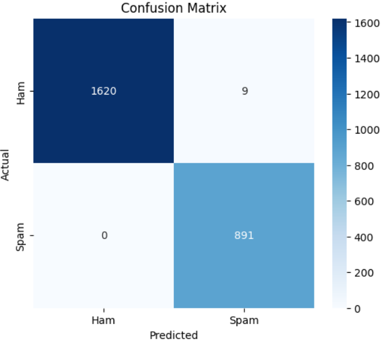

# Email-Spam-Detection-using-Random-Forest
A machine learning project for detecting spam emails using a Random Forest classifier, based on the SpamAssassin Public Corpus dataset.

# Project Overview
The goal of this project is to develop a machine learning model capable of detecting spam emails using a dataset of real-world email samples. The model is built using Python and popular libraries like pandas, scikit-learn, and kagglehub.

# Key components include:
Data preprocessing: Cleaning and transforming the text data into a suitable format.
Model building: Using the Random Forest algorithm to train the classification model.
Evaluation: The model is evaluated on a test set to determine its performance.

# Files
Task_1_Classification_Model_Implementation_using_RandomForest.ipynb: The Jupyter notebook that contains the implementation of the spam detection model.
README.md: Overview of the project, setup instructions, and how to use the code.

# Installation and Setup
# Requirements
To run the code, you will need to have the following installed:
Python 3.x
Required libraries:
pandas
numpy
scikit-learn
kagglehub

# Dataset
The dataset used in this project is the SpamAssassin Public Corpus. The dataset can be downloaded automatically via the kagglehub package.
To manually download, visit the SpamAssassin Public Corpus on kaggle.

# How to Use
1. Clone the repository:
code:
git clone https://github.com/your-username/Email-Spam-Detection-using-Random-Forest.git
2. Open the Jupyter notebook (Task_1_Classification_Model_Implementation_using_RandomForest.ipynb) in Google Colab or Jupyter Notebook.
3. Run the cells in the notebook to train the Random Forest model and evaluate its performance.

# Evaluation Metrics
The model’s performance was evaluated using the following metrics:
Accuracy: 99.64%
Precision: 99.00% (spam), 100% (ham)
Recall: 100% (spam), 99% (ham)
F1-Score: 99.50% (spam), 99.50% (ham)

# Confusion Matrix

